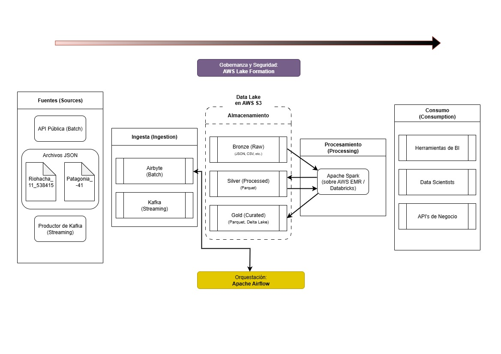

# **Proyecto Integrador M4: Pipeline de Datos ETLT para Weatherlytics**

## **Avance #1: Diseño de Arquitectura y Configuración del Data Lake**

**Autor:** Alejandro Nelson Herrera Soria
**Fecha:** 01 de Octubre de 2025

---

### **1. Contexto del Proyecto y Rol**

Este proyecto aborda el diseño e implementación de un pipeline de datos end-to-end para  **Weatherlytics** , una organización ficticia en proceso de migración hacia una arquitectura de datos moderna en la nube. En mi rol como  **Ingeniero de Datos** , mi primera responsabilidad es establecer los cimientos de esta nueva arquitectura, diseñando un Data Lake escalable, seguro y gobernable sobre la plataforma de Amazon Web Services (AWS).

El objetivo de este primer avance es definir la arquitectura, configurar la infraestructura de almacenamiento base, establecer las políticas de gobernanza y justificar las decisiones técnicas que guiarán las fases posteriores de ingesta, procesamiento y orquestación.

---

### **2. Diagrama de Arquitectura del Pipeline**

La siguiente arquitectura ha sido diseñada para ser modular, escalable y robusta, soportando tanto el procesamiento de datos en batch como en tiempo real (streaming).

**Flujo de Datos Detallado:**

1. **Fuentes (Sources):** Los datos se originan en diversas fuentes, incluyendo archivos históricos (JSON), una API pública de datos meteorológicos ([WeatherAPI.com](https://www.weatherapi.com/my/)), una base de datos PostgreSQL y un futuro productor de eventos en tiempo real (Kafka).
2. **Ingesta (Ingestion):** **Airbyte** se utiliza para la ingesta de datos en batch desde las APIs y la base de datos, depositándolos en la capa inicial del Data Lake. **Kafka** gestionará la ingesta de datos en streaming.
3. **Almacenamiento (Data Lake - AWS S3):** Un bucket S3 centralizado (`weatherlytics-datalake-dev-us-east-2`) actúa como nuestro Data Lake, estructurado en tres capas de refinamiento.
4. **Gobernanza y Seguridad:** **AWS Lake Formation** se posiciona sobre S3 para gestionar de forma centralizada los permisos y la auditoría de acceso a los datos. La gestión de identidades se maneja con  **AWS IAM** .
5. **Procesamiento (Processing):** **Apache Spark** (ejecutado sobre un servicio gestionado como AWS EMR o Databricks) es el motor de transformación. Lee los datos crudos de la capa Bronze, los limpia y estructura en la capa Silver, y finalmente los agrega y optimiza para el negocio en la capa Gold.
6. **Orquestación (Orchestration):** **Apache Airflow** actúa como el cerebro del pipeline, programando, ejecutando y monitoreando los flujos de trabajo de ingesta (vía API) y procesamiento.
7. **CI/CD:** **GitHub Actions** automatiza el despliegue de los DAGs de Airflow, asegurando la integración y entrega continua del código.
8. **Consumo (Consumption):** La capa Gold sirve como la fuente de verdad única para los consumidores finales: analistas de negocio (con herramientas de BI), científicos de datos y otras aplicaciones.

---

### **3. Infraestructura y Estructura del Data Lake en AWS S3**

Se ha configurado la infraestructura de almacenamiento inicial siguiendo las mejores prácticas de la industria:

* **Bucket S3:** `weatherlytics-datalake-dev-us-east-2`
* **Región:** `EE.UU. Este (Ohio) us-east-2`
* **Seguridad:** El acceso público está completamente bloqueado a nivel de bucket.
* **Resiliencia:** Se ha habilitado el control de versiones para proteger contra la pérdida accidental de datos.

La estructura interna del Data Lake sigue la  **arquitectura Medallion** :

* **`/bronze` (Capa Raw):**
  * **Propósito:** Almacena los datos en su estado original, crudo e inmutable. Es una copia exacta de la fuente.
  * **Formato:** JSON, CSV, etc.
* **`/silver` (Capa Processed):**
  * **Propósito:** Contiene datos que han sido limpiados, validados, desduplicados y estandarizados. Los datos aquí están estructurados y listos para ser analizados.
  * **Formato:** Parquet (formato columnar optimizado para análisis).
* **`/gold` (Capa Curated):**
  * **Propósito:** Ofrece vistas de datos agregados y enriquecidos, diseñados específicamente para responder a las preguntas de negocio. Es la capa optimizada para el consumo final.
  * **Formato:** Parquet o Delta Lake.

---

### **4. Gobernanza de Datos con AWS Lake Formation**

El bucket S3 ha sido registrado como una ubicación de Data Lake en  **AWS Lake Formation** . Esta decisión centraliza la gestión de permisos, permitiendo un control de acceso granular a nivel de bases de datos, tablas e incluso columnas, en lugar de gestionar complejas políticas de S3. Esto simplifica la seguridad y facilita la auditoría.

---

### **5. Justificación del Stack Tecnológico**

| Herramienta                  | Justificación de Elección                                                                                                                                                                      |
| ---------------------------- | ------------------------------------------------------------------------------------------------------------------------------------------------------------------------------------------------ |
| **AWS S3**             | Servicio de almacenamiento de objetos líder en la industria, ofrece durabilidad masiva, bajo costo y escalabilidad prácticamente infinita. Es el estándar de facto para construir Data Lakes. |
| **Airbyte**            | Herramienta open-source de ELT que simplifica enormemente la ingesta de datos con una vasta biblioteca de conectores pre-construidos, reduciendo el tiempo de desarrollo.                        |
| **Apache Spark**       | Framework de procesamiento distribuido que permite transformar grandes volúmenes de datos de manera eficiente y escalable. Su API en PySpark facilita el desarrollo.                            |
| **Apache Airflow**     | Orquestador de flujos de trabajo que permite definir, programar y monitorear pipelines complejos como código (DAGs), ofreciendo robustez, reintentos y un alto grado de control.                |
| **AWS Lake Formation** | Servicio gestionado que centraliza y simplifica la seguridad y la gobernanza del Data Lake, un aspecto crítico para cualquier iniciativa de datos a escala empresarial.                         |

Exportar a Hojas de cálculo

---

### **6. Análisis de Fuentes y Preguntas de Negocio Clave**

Los datos iniciales para este proyecto son archivos JSON con series temporales meteorológicas de dos ubicaciones. El objetivo del pipeline es procesar estos datos para poder responder preguntas de negocio como las siguientes:

1. ¿Cuál es la temperatura promedio, máxima y mínima para cada mes en la Patagonia vs. en Riohacha?
2. ¿Cuáles fueron los 5 días más calurosos y los 5 más fríos registrados en cada ubicación?
3. ¿En qué rangos horarios la velocidad del viento en la Patagonia es más favorable para la generación de energía eólica?
4. ¿Qué tan a menudo la sensación térmica en Riohacha es significativamente superior a la temperatura real?
5. ¿Cuál es la variabilidad térmica diaria promedio para cada estación del año en ambas locaciones?
6. ¿Cuál es la dirección del viento predominante durante el invierno en la Patagonia?
7. ¿Los cambios abruptos en la presión atmosférica preceden a cambios significativos en el clima?
8. ¿Cuántas horas al día la humedad relativa en Riohacha se mantiene por encima del 80%?
9. ¿Existe una correlación directa entre la humedad relativa y el punto de rocío en cada ubicación?
10. ¿Hay momentos del año en que la temperatura se acerca al punto de rocío, indicando alta probabilidad de niebla?

Este primer avance sienta las bases conceptuales y técnicas para el desarrollo exitoso del pipeline de datos de Weatherlytics.
