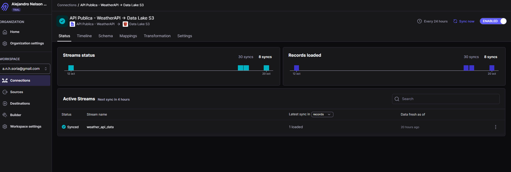

## **Avance #2:** 

## **Ingesta de Datos con Airbyte**

**Realizado por:** Alejandro N. Herrera Soria

En esta segunda fase, el objetivo fue construir el primer componente funcional de nuestro pipeline: la ingesta de datos. Utilizando  **Airbyte Cloud** , configuramos y ejecutamos la "tubería" para mover datos desde una API pública hacia la capa `bronze` de nuestro Data Lake en AWS S3.

---

### ### 1. Configuración del Destino en Airbyte (AWS S3)

Antes de poder ingestar datos, fue necesario configurar el destino final. Para ello, se siguieron las mejores prácticas de seguridad en AWS.

**a. Creación de un Usuario IAM Dedicado:**
Para permitir que Airbyte acceda a nuestro bucket de forma segura, se creó un usuario programático en AWS IAM (`airbyte-s3-writer`) con una política de permisos personalizada que solo le otorga acceso de lectura y escritura a nuestro bucket S3 (principio de mínimo privilegio).

**b. Configuración del Destino en Airbyte:**
Con las credenciales del usuario IAM, se configuró el destino en la interfaz de Airbyte Cloud.

* **Nombre del Destino:** `Data Lake S3`
* **Bucket S3:** `weatherlytics-datalake-dev-us-east-2`
* **Ruta del Bucket:** `bronze/` (crucial para asegurar que los datos crudos aterricen en la capa correcta).
* **Región:** `us-east-2`
* **Formato de Salida:**  **Parquet** , un formato columnar eficiente, ideal para análisis posteriores con Spark.

---

### ### 2. Configuración de la Fuente de Datos (API Pública)

Para cumplir con la consigna de conectar a una API pública, se utilizó el conector **File** de Airbyte, configurado para leer desde una URL HTTPS.

* **Nombre de la Fuente:** `API Publica - WeatherAPI`
* **Proveedor:** `HTTPS – Public Web`
* **URL:** Se construyó la URL completa, incluyendo la API Key y la ciudad a consultar, para realizar la petición GET:
  ```
  http://api.weatherapi.com/v1/current.json?key=[TU_API_KEY]&q=Riohacha
  ```
* **Nombre del Dataset:** `weather_api_data` (Este nombre se usará para la carpeta de destino en S3).

*(Nota: Aunque se exploró la ingesta desde una base de datos PostgreSQL, se descartó siguiendo las aclaraciones del profesor sobre el alcance real del proyecto, que se centra en los datos de la API y los archivos JSON históricos).*

---

### ### 3. Creación y Ejecución de la Conexión

Con la fuente y el destino configurados, se procedió a crear la conexión principal.

1. **`API WeatherAPI to S3 (Corregida)`** : Conectó la fuente de la API con el destino S3.

Se configuró la conexión con una replicación **`Full Refresh | Overwrite`** y se programó para ejecutarse  **cada 24 horas** , asegurando una ingesta diaria y automática de los datos más recientes del clima.



---

### ### 4. Validación Final

El último paso fue validar que los datos se ingirieron correctamente en nuestro Data Lake:

* Se accedió al bucket `weatherlytics-datalake-dev-us-east-2` a través de la consola de AWS.
* Dentro de la carpeta `bronze/`, se verificó la existencia de la carpeta `weather_api_data/`.
* Se navegó dentro de esta carpeta para confirmar que Airbyte escribió exitosamente los archivos de datos en formato  **`.parquet`** .

Con esta validación, se dio por finalizado y completado con éxito el `Avance #2` del proyecto.


---

### ### Recursos Utilizados

* **Airbyte Cloud (Free Tier):** Plataforma central para la ingesta de datos.
* **AWS S3:** Para el almacenamiento en la capa `bronze`.
* **AWS IAM:** Para la gestión segura de credenciales de acceso.
* **WeatherAPI.com:** Como fuente de datos de API pública.
