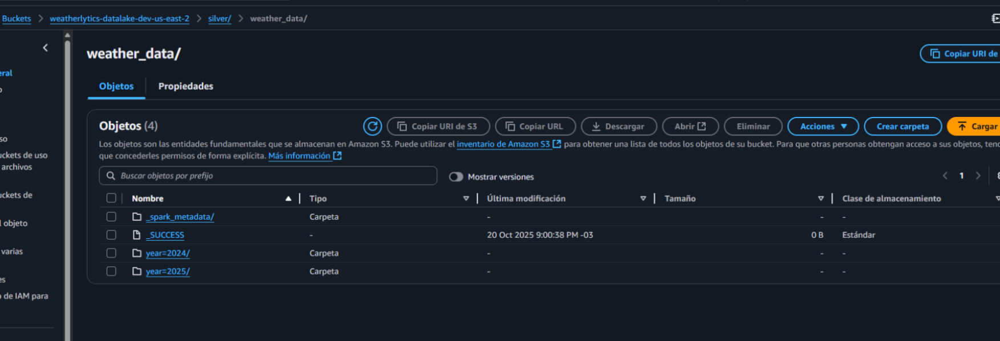

## Avance 3

## Procesamiento de Datos con Spark

**Realizado por:** Alejandro N. Herrera Soria

Este es el avance central del proyecto, donde se aplica la "Lógica de Transformación (la 'T' en ETLT)".

El objetivo fue leer los datos crudos de las distintas fuentes almacenadas en la capa bronze, unificarlos, limpiarlos y escribirlos en una capa silver optimizada, listos para el análisis.

Este proceso se diseñó para ser ejecutado en un entorno Apache Spark desplegado en una instancia EC2 de AWS, utilizando un script de PySpark.

---

### ### 1. Desafíos y Soluciones: Del Entorno Local a la Nube

La implementación de este avance se dividió en dos fases principales: un intento inicial en un entorno local (Windows) y la migración final a un entorno de nube (EC2/Docker), que fue la solución definitiva.

#### Fase 1: Pruebas en Entorno Local (Windows) y Bloqueo

El plan inicial era desarrollar y probar el script de PySpark localmente.

1. Configuración: Se creó un entorno virtual (venv) y se instalaron pyspark, boto3 y s3fs.
2. Problema 1: ModuleNotFoundError

* Error: No module named 'pyspark'.
* Diagnóstico: Las librerías se habían instalado globalmente antes de activar el venv.
* Solución: Se reinstalaron las librerías dentro del entorno virtual activado.

3. Problema 2: Error de winutils.exe

* Error: HADOOP_HOME and hadoop.home.dir are unset.
* Diagnóstico: Un problema clásico de Spark en Windows. Faltaban los binarios de winutils.exe.
* Solución: Se descargó winutils.exe (v3.3.5) y se configuraron las variables de entorno $env:HADOOP_HOME y $env:PATH en PowerShell.

4. Problema 3: Error de Conexión a S3

* Error: java.lang.NumberFormatException: For input string: "60s".
* Diagnóstico: Un conflicto de versiones en las librerías Java (JARs) que usa Spark para conectarse con S3.
* Solución (Pivote): Tras varios intentos fallidos de ajustar los JARs y sospechar de una incompatibilidad con Java 17, se decidió abandonar el desarrollo local y replicar el entorno de la nube recomendado por el profesor, eliminando así las complejidades de Windows.

#### Fase 2: Migración a AWS EC2 (La Solución Exitosa)

Se provisionó un entorno en AWS alineado con las recomendaciones de la cátedra.

a. Configuración de Instancia EC2:

* Instancia Inicial: Se comenzó con t3.small (2GB RAM).
* Problema: La conexión SSH de VS Code era extremadamente inestable, se quedaba "inicializando" y sufría timeouts (Extension host (Remote) is unresponsive).
* Diagnóstico: Falta de memoria RAM para correr el sistema operativo, el servidor VS Code y Docker/Spark.
* Solución: Se redimensionó la instancia a m7i-flex.large (8GB RAM), que estaba disponible en la capa gratuita.
* Rol IAM: Se creó el rol EC2-S3-Access-Role con la política AmazonS3FullAccess y se asignó a la instancia. Esta fue la clave para la autenticación en S3 sin usar claves de acceso.

b. Depuración de la Conexión SSH:

* Problema 1: Bad permissions en el archivo .pem.
* Solución: Se ajustaron los permisos del archivo .pem en Windows (Propiedades > Seguridad > Opciones Avanzadas) para eliminar la herencia y dejar solo al usuario actual con control.
* Problema 2: InvalidHostName (error de \).
* Solución: Se editó el archivo config de SSH en VS Code (Remote-SSH: Open Configuration File...) para usar barras inclinadas (/) en la ruta IdentityFile.
* Problema 3: Host desconocido (error de DNS).
* Solución: Se reemplazó el DNS público en el archivo config por la dirección IP pública estática (3.128.29.149) de la instancia.

c. Configuración de Spark con Docker:

* Instalación: Se instaló docker.io y docker-compose en la instancia Ubuntu.
* Problema 1: PermissionError: [Errno 13] Permission denied al usar docker-compose.
* Diagnóstico: El usuario ubuntu no estaba en el grupo docker.
* Solución: Se ejecutó sudo usermod -aG docker $USER y, crucialmente, se reinició la conexión SSH (Cerrar Conexión Remota y reconectar) para que el cambio de grupo tuviera efecto.
* Problema 2: El contenedor de Spark se detenía (Exited (0)) tras iniciarse.
* Solución: Se añadió el comando command: ["/bin/bash", "-c", "tail -f /dev/null"] al docker-compose.yml para mantener el contenedor en ejecución.
* Dockerfile: Se usó la imagen oficial apache/spark:3.5.1-python3 (descartando Bitnami) y se instalaron boto3 y s3fs vía pip.

---

### ### 2. Script PySpark (process_weather_data.py)

Con el entorno de nube funcionando, se ejecutó el script de procesamiento final.

a. Autenticación y Conexión:

* La sesión de Spark se configuró para usar el Rol de IAM de la EC2, eliminando la necesidad de gestionar claves de acceso (AWS_ACCESS_KEY_ID, AWS_SECRET_ACCESS_KEY) en el script.
* Se usó el comando spark-submit con la ruta completa (/opt/spark/bin/spark-submit) y el flag --packages para cargar explícitamente los JARs correctos y solucionar el error ClassNotFoundException: S3AFileSystem:
  Bash
  --packages org.apache.hadoop:hadoop-aws:3.3.4,com.amazonaws:aws-java-sdk-bundle:1.12.262

b. Lógica de Transformación (El "Aha!"):

* Problema: El script inicial falló. Los logs mostraron que los archivos JSON históricos no tenían la estructura anidada (hourly.time) que esperábamos.
* Diagnóstico (Lectura de Logs): Los printSchema() revelaron que los JSON se estaban leyendo como una estructura plana (city_name, dt, main.temp) y los Parquet de Airbyte venían sin la envoltura _airbyte_data.
* Solución (Refactorización): Se reescribió la lógica de transformación (Paso 2) para que se adaptara a los esquemas reales leídos de la capa bronze.
* Procesamiento JSON: Se adaptó para leer city_name, dt, main.temp, main.humidity, main.pressure, wind.speed y wind.deg.
* Procesamiento Parquet: Se adaptó para leer location.name, current.last_updated_epoch, current.temp_c, etc.

c. Escritura en Capa Silver:

* El script unificó con éxito los dos DataFrames transformados.
* Los datos limpios se escribieron en la capa silver (s3a://weatherlytics-datalake-dev-us-east-2/silver/weather_data) usando formato Parquet y particionados por year, month y location para optimizar futuras consultas.

---

### ### 3. Validación

La ejecución del script finalizó con el mensaje Datos escritos exitosamente....

Una verificación manual en la consola de S3 confirmó el éxito:

* Se encontró el archivo _SUCCESS en silver/weather_data/.
* Se encontraron las carpetas de partición correctas (ej: year=2024/, year=2025/), que a su vez contenían las sub-particiones de month= y location=, demostrando que el Avance #3 se completó exitosamente.

