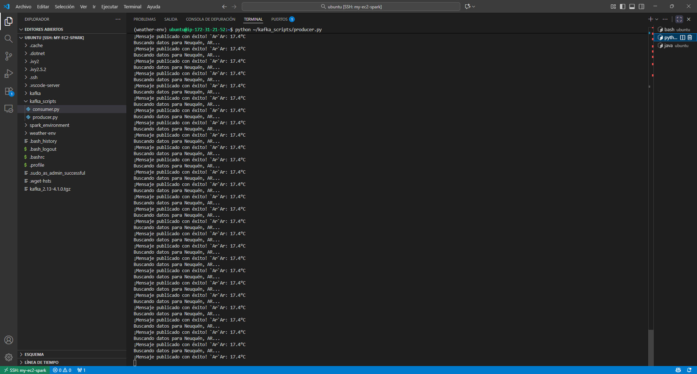

## **Avance #4 y #5**

## **Orquestación con Airflow e Implementación de Streaming con Kafka**

**Realizado por:** Alejandro N. Herrera Soria

En esta fase final, el proyecto se centró en dos objetivos críticos:

1. **Orquestación (Avance 4):** Automatizar el pipeline BATCH (el script de Spark que procesa de `bronze` a `silver`/`gold`) utilizando Apache Airflow.
2. **Streaming (Avance 5):** Implementar un pipeline de streaming en tiempo real utilizando Apache Kafka para ingestar datos de la API, cumpliendo con la arquitectura Lambda del proyecto.

Ambas tareas se desplegaron en sus propias instancias EC2, creando una arquitectura distribuida y desacoplada.

---

### ### 1. Despliegue del Orquestador (Apache Airflow)

Se provisionó una instancia EC2 dedicada (`airflow-server-instance`) para actuar como el orquestador (el "jefe de cocina").

**Configuración de la Instancia EC2 (Airflow):**

* **Instancia:** `m7i-flex.large` (8 GB RAM).
  * *Lección Aprendida (Problema):* Se intentó inicialmente con una `t3.small` (2 GB RAM), pero la conexión SSH de VS Code fallaba constantemente por timeouts.
  * *Solución:* Se redimensionó la instancia a una con 8 GB de RAM (disponible en la capa gratuita) para manejar la carga de Airflow y sus servicios.
* **Imagen:** Ubuntu Server LTS.
* **Grupo de Seguridad (`airflow-sg`):**
  * Puerto `22` (SSH) abierto a nuestra IP local.
  * Puerto `8080` (Airflow Web UI) abierto a `0.0.0.0/0` (público).

**Desafío de Instalación: `docker-compose` vs. `pip`**

* **Problema:** El plan inicial de usar el `docker-compose.yaml` oficial de Airflow falló. Al ejecutar `docker-compose up -d`, la terminal devolvía errores `503 Service Unavailable` y `UNAUTHORIZED` al intentar descargar la imagen `postgres:13`.
* **Diagnóstico:** Se confirmó que la instancia SÍ tenía acceso a Internet (usando `curl https://www.google.com`). El problema era externo: **Docker Hub estaba aplicando límites de peticiones (rate-limiting)** a la IP de la instancia de AWS, impidiendo la descarga.
* **Solución (Pivote Estratégico):** Se **abandonó la instalación con Docker Compose** y se adoptó el método "bare-metal" (nativo) usando `pip`, siguiendo las guías de la cátedra.

**Pasos de Instalación de Airflow (Bare-Metal):**

1. Se instalaron las dependencias: `sudo apt install python3-pip python3.12-venv -y`.
2. Se creó un entorno virtual: `python3 -m venv ~/airflow-env` y se activó.
3. Se instaló Airflow con los "extras" necesarios para el proyecto: `pip install "apache-airflow[postgres,ssh]"`.
4. Se inicializó la base de datos:
   * *Problema:* El comando `airflow db init` falló (obsoleto).
   * *Solución:* Se usó el comando moderno: `airflow db migrate`.
5. Se creó el usuario administrador:
   * *Problema:* El comando `airflow users create` falló (`invalid choice: 'users'`), ya que el paquete `www` no se había instalado.
   * *Solución:* Se utilizó el comando  **`airflow standalone`** . Este comando se encargó de inicializar la BD, crear el usuario `admin` con una contraseña temporal y lanzar todos los servicios.

**Automatización del Servicio (systemd):**

* **Problema:** `airflow standalone` se ejecuta en la terminal, no es un servicio persistente.
* **Solución:** Se creó un servicio de `systemd` (`/etc/systemd/system/airflow.service`) para que Ubuntu gestione Airflow automáticamente, asegurando que se inicie al arrancar y se reinicie si falla.

**Ini, TOML**

```
[Unit]
Description=Airflow Standalone Service
After=network.target

[Service]
User=ubuntu
Group=ubuntu
WorkingDirectory=/home/ubuntu/airflow
Environment="PATH=/home/ubuntu/airflow-env/bin"
ExecStart=/home/ubuntu/airflow-env/bin/airflow standalone
Restart=always
RestartSec=5s

[Install]
WantedBy=multi-user.target
```

---

### ### 2. Orquestación del Job de Spark (El DAG)

El objetivo era que Airflow (en su máquina) le ordenara a la instancia de Spark (en su otra máquina) que ejecutara el script `process_weather_data.py`.

**a. Conexión Airflow -> Spark:**

* Se usó la solución recomendada en clase: el  **`SSHOperator`** .
* Se creó una conexión en la UI de Airflow (`Admin` > `Connections`):
  * **Conn Id:** `ssh_spark_worker`
  * **Conn Type:** `SSH`
  * **Host:** La IP pública de la instancia de Spark (`3.128.29.149`).
  * **Username:** `ubuntu`
  * **Extras (JSON):** Se pegó el contenido de la clave `.pem` formateado en JSON.

**b. El DAG (`etl_pipeline_dag.py`):**
Se creó el DAG para definir el flujo de trabajo.

* **Desafío 1: `exit status = 1` (Fallo 1)**
  * **Diagnóstico:** El `SSHOperator` se conectaba, pero el comando `docker-compose` fallaba porque se ejecutaba en `~` y no en `~/spark_environment`.
  * **Solución:** Se añadió `cd ~/spark_environment && \` al comando del DAG.
* **Desafío 2: `exit status = 1` (Fallo 2)**
  * **Diagnóstico:** `docker-compose` necesita `sudo`, pero `sudo` requiere una "terminal" (TTY) interactiva, y el `SSHOperator` no la provee por defecto.
  * **Solución:** Se añadió el parámetro `get_pty=True` al `SSHOperator` en el DAG, forzando la simulación de una terminal.
* **Desafío 3: Fallo de Conexión**
  * **Diagnóstico:** El DAG fallaba al conectar. Se descubrió que la instancia de Spark (`spark-worker-instance`) estaba **detenida** para ahorrar costos.
  * **Solución:** Se inició la instancia de Spark, se actualizó la IP pública en la conexión `ssh_spark_worker` de Airflow y se reinició el contenedor de Docker en la instancia de Spark (`docker-compose up -d`).
* **Resultado: ¡ÉXITO!** El DAG se ejecutó correctamente, orquestando todo el pipeline BATCH.


**c. Configuración de Alertas por Email:**

* Se generó una "Contraseña de Aplicación" de 16 dígitos en Google (requiere 2-Step-Auth).
* Se configuró el `airflow.cfg` en la sección `[smtp]` con los datos de Gmail.
* **Problema:** El DAG no enviaba correos.
* **Solución:** Se usó un script de prueba (`test_email.py`) que falló con `ascii' codec can't encode character...`. El problema era el `¡` en el mensaje de prueba. Se corrigió añadiendo `.encode("utf-8")` al `sendmail`.
* **Solución Final:** Se reinició el servicio `airflow standalone` (luego el `systemd`) para que cargara la nueva configuración SMTP, y se añadieron los `default_args` al DAG:
  **Python**

  ```
  default_args = {
      'email': ['tu-email-de-destino@gmail.com'],
      'email_on_failure': True,
      'email_on_success': True,
  }
  ```

---

### ### 3. Implementación de Streaming con Kafka (Avance #5)

Para cumplir con la arquitectura Lambda completa, se implementó un pipeline de streaming.

**a. Instalación de Kafka:**

* Se instaló Kafka (v4.1.0) nativamente en la instancia de **Spark** (`my-ec2-spark`), siguiendo la guía `kafka1.txt`.
* **Problema 1:** El comando `kafka-storage.sh format` falló (`NoSuchFileException: config/kraft/server.properties`).
  * **Solución:** Se usó la ruta correcta: `config/server.properties`.
* **Problema 2:** El formateo falló (`controller.quorum.voters is not set`).
  * **Solución:** Se añadió el flag `--standalone` al comando `format`.
* **Problema 3:** El servidor Kafka falló al iniciar (`controller.listener.names must contain...`).
  * **Solución:** Se editó `server.properties` para separar los listeners (uno para `PLAINTEXT` en el puerto `9092` y otro para `CONTROLLER` en el `9093`), resolviendo el conflicto de KRaft.
* Se creó el topic: `bin/kafka-topics.sh --create --topic openweather-topic ...`


**b. El Productor (`producer.py`):**

* **Problema:** El script `producer.py` fallaba con `Error al publicar: 'coord'`.
* **Diagnóstico:** Se descubrió una discrepancia crítica. El `producer.py` estaba escrito para la API de  **OpenWeatherMap** , pero nosotros estábamos usando una clave de **WeatherAPI.com** (del Avance 2).
* **Solución:** Se reescribió la lógica de `producer.py` para:
  1. Llamar a la URL correcta de `weatherapi.com` con la clave correcta (`415a...`).
  2. Parsear la respuesta de WeatherAPI (`current.temp_c`, etc.).
  3. **Reformatear** el JSON de salida para que coincidiera con la estructura que el `consumer.py` esperaba.



**c. El Consumidor (`consumer.py`):**

* Se utilizó el script `consumer.py` provisto, que usa Spark Structured Streaming.
* **Problema 1:** `IndentationError` y `SyntaxError`.
  * **Solución:** Se limpió el script de espacios/caracteres invisibles producto de copiar y pegar.
* **Problema 2:** `java.lang.NoSuchMethodError: 'scala.collection.mutable.WrappedArray...'`.
  * **Diagnóstico:** Conflicto de versiones. `pip install pyspark` instaló  **Spark 4.0.1** , pero los paquetes (`--packages`) eran para  **Spark 3.5.1** .
  * **Solución:** Se alinearon las versiones: `pip uninstall pyspark` seguido de `pip install pyspark==3.5.1`.
* **Resultado Final:** Con el productor enviando datos formateados de WeatherAPI y el consumidor corriendo con la versión correcta de Spark, el pipeline de streaming comenzó a escribir datos en tiempo real en la capa `silver` de S3, completando así toda la arquitectura del proyecto.


